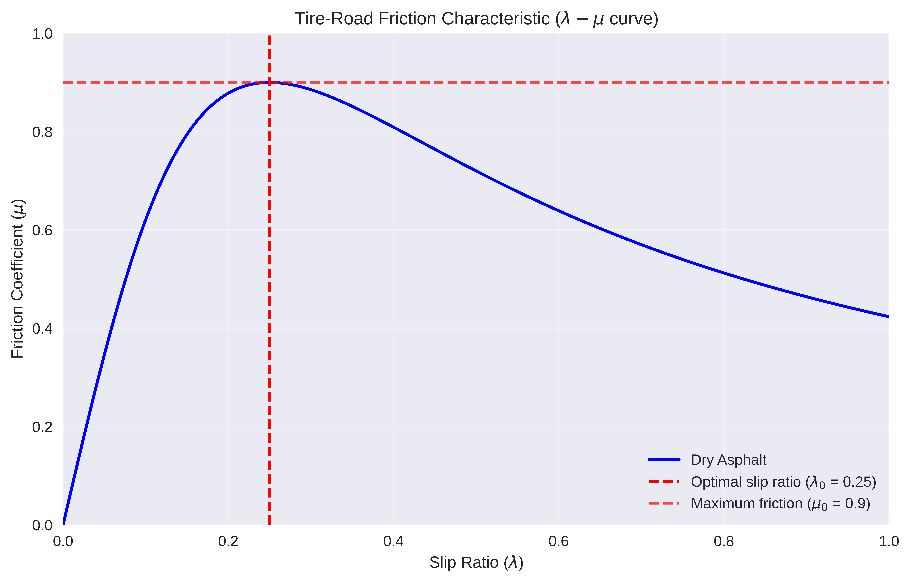

# NARMA-L2 Neural Network Controller for Anti-Lock Braking System


A neural network-based feedback linearization controller (NARMA-L2) for optimal slip ratio regulation in an Anti-Lock Braking System (ABS), implemented from scratch based on a published research paper.

## Motivation

Traditional ABS controllers rely on threshold-based logic or PID tuning, which struggle with the highly nonlinear tire-road friction dynamics. This project implements a **NARMA-L2 (Nonlinear Autoregressive Moving Average - Level 2)** controller that learns the nonlinear dynamics and cancels them through feedback linearization, achieving tighter slip ratio regulation than a conventional PID.

## Key Results

### Slip Ratio Regulation: NARMA-L2 vs PID

The NARMA-L2 controller maintains the slip ratio closer to the optimal value (0.25) compared to the PID controller, with less oscillation and faster convergence.

<p align="center">
  
</p>

### Tire-Road Friction Model

The system uses a quarter-car model with a nonlinear friction characteristic that peaks at the optimal slip ratio.

<p align="center">
  
</p>

### Neural Network Training

Both f-network and g-network converge reliably during training.

<p align="center">
  
</p>

## Architecture

The project implements a complete ABS simulation and control pipeline:

```
Quarter-Car Model          NARMA-L2 Controller          Comparison
┌──────────────────┐      ┌──────────────────────┐      ┌────────────┐
│ Vehicle dynamics │      │ f-network (nonlinear │      │ NARMA-L2   │
│ Wheel dynamics   │────▶│   dynamics)          │─────▶│ vs         │
│ Brake actuator   │      │ g-network (system    │      │ PID        │
│ Friction model   │      │   sensitivity)       │      │ controller │
└──────────────────┘      └──────────────────────┘      └────────────┘
```

### Mathematical Model

The NARMA-L2 model decomposes the system as:

$$y(k+d) = f(\cdot) + g(\cdot) \times u(k+1)$$

Where **f** captures the autonomous nonlinear dynamics and **g** captures the system's sensitivity to the control input. Both are approximated by single-hidden-layer neural networks (5 neurons, tanh activation).

The control law inverts this model:

$$u(k+1) = \frac{y_{ref} - f(\cdot)}{g(\cdot)}$$

## Project Structure

```
abs_narmal2/
├── ABS.ipynb                  # Main notebook with full pipeline and visualizations
├── src/
│   ├── __init__.py
│   ├── abs_simulator.py       # Quarter-car ABS model and data generation
│   ├── pid_controller.py      # PID controller with filtered derivative
│   └── narmal2_controller.py  # NARMA-L2 neural network controller
├── figures/                   # Generated plots and visualizations
├── requirements.txt
├── LICENSE
└── README.md
```

## Getting Started

### Prerequisites

- Python 3.10 or higher
- pip

### Installation

```bash
git clone https://github.com/your-username/abs_narmal2.git
cd abs_narmal2
pip install -r requirements.txt
```

### Usage

**Run the full notebook:**

```bash
jupyter notebook ABS.ipynb
```

**Use the modules directly:**

```python
from src import ABSSystemSimulator, PIDController, NARMAL2Controller

# Simulate braking scenarios
simulator = ABSSystemSimulator()
data = simulator.generate_training_data(n_scenarios=50)

# Train the NARMA-L2 controller
controller = NARMAL2Controller(hidden_neurons=5)
controller.train(data, epochs=100)

# Compute control input for a given state
import numpy as np
state = np.array([0.3, 0.28, 0.25, 500, 480, 450])
u = controller.compute_control_input(state, reference_slip=0.25)
```

## Technical Details

| Component         | Specification                                 |
| ----------------- | --------------------------------------------- |
| Vehicle model     | Quarter-car, 440 kg                           |
| Friction model    | Nonlinear $\mu$-$\lambda$ curve (dry asphalt) |
| Neural networks   | 1 hidden layer, 5 neurons, tanh activation    |
| Training data     | 50 scenarios, PID-controlled braking          |
| Optimizer         | Adam (lr=0.001)                               |
| Target slip ratio | $\lambda_0 = 0.25$                            |

## Reference

This implementation is based on:

> J. O. Pedro, O. T. C. Nyandoro, S. John, **"Neural Network Based Feedback Linearisation Slip Control of an Anti-Lock Braking System"**, 7th Asian Control Conference, Hong Kong, China, August 27-29, 2009.
> [IEEE Xplore](https://ieeexplore.ieee.org/document/5276197)

## Author

**Martin Astyan** — Architecture of Intelligent Transport Systems, 2025

## License

This project is licensed under the MIT License — see [LICENSE](LICENSE) for details.
